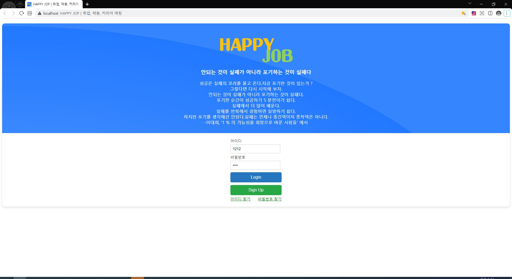

# 📚 채용박람회

## 1️⃣ 프로젝트 소개

🔹 이 프로젝트는 **리액트**로 구현된 **채용박람회 웹 애플리케이션**입니다.
<br><br>
🔹 사용자들은 다양한 채용 정보를 확인하고, 관심 있는 직무에 지원할 수 있습니다.
<br><br>
🔹 기존 Spring 기반 백엔드와 연동하여, 채용 공고 리스트와 상세 정보를 제공하며, 사용자 경험을 개선하기 위한 다양한 기능을 제공합니다.

<br>

## 2️⃣ 팀원 구성

<div align="center">
  
| **황윤기** | **이민서** | **손신효** |
| :------: |  :------: | :------: |
| [ <br/> @hykworld](https://github.com/hykworld) | [ <br/> @Dev-miiing](https://github.com/Dev-miiing) | [ <br/> @shinyorrr](https://github.com/shinyorrr) |

<br>

| **유성찬** | **우황희** | **김호관** |
| :------: |  :------: | :------: |
| [ <br/> @it-is-wanthefull](https://github.com/it-is-wanthefull) | [ <br/> @skh9301](https://github.com/skh9301) | [ <br/> @KimHoKwan](https://github.com/KimHoKwan) |
  
</div>
<br>

## 3️⃣ 개발환경 및 기술 스택

🔸 **Front** :        
<br>
🔸 **Back-end** :   
<br>
🔸 **Database** :  
<br>
🔸 **Version Control** :   
<br>
🔸 **Build Tools** :  
<br>
🔸 **IDE/Editor** :  

<br>

## 4️⃣ 채택한 개발 기술과 그 이유
- **Front-end**  
  - **React** : React는 구성 요소 기반의 UI 라이브러리로, 재사용 가능한 컴포넌트를 만들 수 있어 유지 보수가 용이하고, 강력한 생태계와 커뮤니티 지원을 제공합니다. 또한, 가상 DOM을 통해 빠른 렌더링 성능을 제공합니다.  
  - **TypeScript** : JavaScript의 정적 타입 검사 기능을 제공하여, 코드 작성 시 발생할 수 있는 오류를 사전에 예방하고 코드의 가독성과 유지보수성을 향상시킵니다. 또한, IDE에서 더 나은 자동 완성과 리팩토링 지원을 받을 수 있습니다.  
  - **Recoil** : React 상태 관리를 더 효율적으로 처리하기 위한 라이브러리입니다. Recoil은 React의 컴포넌트와 상태를 쉽게 관리할 수 있게 도와주며, 복잡한 애플리케이션에서도 관리가 용이합니다.  
  - **Recoil-persist** : 애플리케이션의 상태를 로컬 스토리지에 저장하여, 페이지 새로고침 시에도 상태를 유지할 수 있습니다. 이는 사용자가 애플리케이션을 끄고 다시 켰을 때 이전 상태를 복구할 수 있도록 도와줍니다.  
  - **React Router** : React 애플리케이션에서 페이지 간의 이동을 처리하기 위한 라이브러리입니다. SPA(Single Page Application) 개발 시 URL을 통해 페이지를 관리할 수 있어 사용자 경험을 향상시킬 수 있습니다.  
  - **Axios** : API 요청을 위한 HTTP 클라이언트로, 프로미스를 사용해 비동기 처리를 쉽게 할 수 있고, JSON 데이터 처리가 용이하며, 오류 처리와 인터셉터 설정 등의 기능을 제공합니다.  
  - **Styled-components** : CSS-in-JS 방식을 사용하여 컴포넌트와 스타일을 함께 정의할 수 있습니다. 이를 통해 CSS의 범위를 컴포넌트로 제한하여 스타일 충돌을 방지하고, 동적으로 스타일을 제어할 수 있습니다.

- **Back-end**
  - **Node.js** : 비동기 이벤트 기반의 JavaScript 런타임 환경으로, 고성능의 네트워크 애플리케이션을 개발할 수 있습니다.
  - **Spring** : Java 기반의 엔터프라이즈급 애플리케이션을 구축하는 프레임워크로, 의존성 주입 및 다양한 기술을 지원합니다.
  - **Java** : 객체 지향 언어로, 플랫폼에 독립적인 애플리케이션을 구축할 수 있습니다.
 
- **Database**
  - **MySQL** : 관계형 데이터베이스 관리 시스템(RDBMS)으로, 데이터를 테이블 형식으로 저장하고 SQL을 사용해 데이터를 처리합니다.

- **Version Control**  
  - **GitHub** : Git을 기반으로 한 웹 호스팅 서비스로, 버전 관리와 협업을 지원합니다. 코드의 버전을 추적하고, 여러 개발자가 동시에 작업할 수 있도록 효율적인 협업 환경을 제공합니다.  
  - **SVN** : Subversion은 중앙 집중식 버전 관리 시스템으로, 소스 코드의 변경 사항을 추적하고 여러 버전을 관리하는 데 유용합니다. 대규모 프로젝트에서 팀 작업을 원활하게 지원합니다.
 
- **Build Tools**
  - **npm** : Node.js의 패키지 관리자이자 빌드 도구로, JavaScript 라이브러리 및 패키지의 관리와 스크립트 실행을 지원합니다.
  - **Maven** : Java 프로젝트의 빌드, 의존성 관리 및 배포를 위한 빌드 도구입니다. XML 기반의 설정 파일을 통해 프로젝트의 구조와 의존성 관리를 간편하게 할 수 있습니다.

- **IDE/Editor**
  - **VS Code** : 가볍고 확장 가능한 코드 편집기로, 다양한 언어 지원 및 플러그인을 제공합니다.
  - **Eclipse** : Java 개발을 위한 강력한 IDE로, 대규모 프로젝트와 팀 작업에 적합합니다.


<br>

## 5️⃣ 프로젝트 구조

```jsx
├── README.md
├── .eslintrc.js
├── .gitignore
├── .prettierrc.json
├── package-lock.json
├── package.json
│
├─public
│  └─images
│      └─admin
│          └─comm
└─src
    ├─api
    │  └─provider
    ├─assets
    ├─common
    │  └─css
    ├─component
    │  ├─common
    │  │  ├─Button
    │  │  ├─ContentBox
    │  │  ├─CustomHook
    │  │  ├─NotFound
    │  │  ├─pageNavigation
    │  │  ├─portal
    │  │  └─styled
    │  ├─layout
    │  │  ├─DashBoard
    │  │  └─LeftMenuBar
    │  └─page
    │      ├─Applicant
    │      ├─apply
    │      │  ├─ReseumeMain
    │      │  └─ResumeDetail
    │      ├─company
    │      │  ├─CompanyDetail
    │      │  ├─CompanyUpdatePage
    │      │  └─CompanyWritePage
    │      ├─Faq
    │      │  ├─FaqMain
    │      │  ├─FaqModal
    │      │  └─FaqSearch
    │      ├─Hire
    │      ├─History
    │      │  ├─CancelModal
    │      │  ├─HistoryMain
    │      │  ├─HistoryModal
    │      │  └─HistorySearch
    │      ├─Login
    │      │  ├─LoginMain
    │      │  └─LoginModal
    │      ├─manage-posts
    │      │  ├─applyModal
    │      │  ├─PostDetail
    │      │  ├─PostMain
    │      │  ├─PostSearch
    │      │  └─ScrapList
    │      ├─manage-user
    │      │  ├─ManageUserMain
    │      │  ├─ManageUserModal
    │      │  └─ManageUserSearch
    │      ├─MyPage
    │      │  ├─MyPageMain
    │      │  └─MyPageModal
    │      ├─Notice
    │      │  ├─NoticeMain
    │      │  ├─NoticeModal
    │      │  └─NoticeSearch
    │      └─Qna
    │          ├─QnaMain
    │          ├─QnaModal
    │          └─QnaSearch
    ├─css
    ├─hook
    ├─models
    │  └─interface
    │      └─store
    ├─pages
    ├─proxy
    ├─routers
    └─stores
```

<br>

## 6️⃣ 역할분담


<br>

## 7️⃣ 페이지별 기능

### 🆔 메인 페이지(http://localhost:3000/react)

- 첫 화면은 로그인 페이지입니다. 이 페이지에서는 사용자가 시스템에 로그인할 수 있습니다. 로그인 화면에서는 다음과 같은 기능을 제공합니다:

  - 로그인: 이미 가입된 사용자들이 아이디와 비밀번호를 입력하여 로그인할 수 있습니다.
  - 회원가입:
    - 기업 사용자: 기업 사용자가 가입할 수 있는 별도의 회원가입 링크입니다.
    - 일반 사용자: 일반 사용자가 가입할 수 있는 회원가입 링크입니다.
  - 아이디/비밀번호 찾기: 아이디 또는 비밀번호를 잊어버린 사용자가 이를 재설정할 수 있는 링크입니다.

<br>

### ✳ 대시보드(http://localhost:3000/)

- 왼쪽 사이드바는 로그인한 사용자의 역할에 따라 다르게 표시됩니다. 각 사용자는 관리자, 기업 사용자, 일반 사용자로 구분되며, 이 역할에 맞는 메뉴와 권한을 부여받습니다.

  - 관리자: 모든 기능에 접근할 수 있는 권한을 가지며, 사용자 관리, 시스템 설정 등 관리자가 수행해야 할 작업을 할 수 있는 메뉴가 표시됩니다.
  - 기업 사용자: 기업 관련 정보나 관리 기능에 접근할 수 있습니다. 예를 들어, 기업 대시보드, 프로젝트 관리 등 기업에 맞는 메뉴가 표시됩니다.
  - 일반 사용자: 기본적인 기능만 사용 가능한 일반 사용자에게는 제한된 메뉴만 제공됩니다. 예를 들어, 개인 정보 확인, 설정 등이 가능합니다.
- 이 역할에 따른 메뉴는 역할 분담에서 확인할 수 있습니다. 로그인 시 사용자 역할에 맞춰 사이드바가 동적으로 변경되어, 사용자 경험을 향상시키고, 각 역할에 맞는 기능만을 제공하게 됩니다.

<br>
- 대시보드에서는 오늘의 급식 메뉴를 표시하는 기능이 있습니다. 이 기능은 사용자가 오늘 제공되는 급식 메뉴를 쉽게 확인할 수 있도록 돕습니다. 시스템은 매일마다 해당 날짜에 맞는 급식 메뉴를 자동으로 업데이트하여, 웹 페이지에서 실시간으로 제공됩니다.


